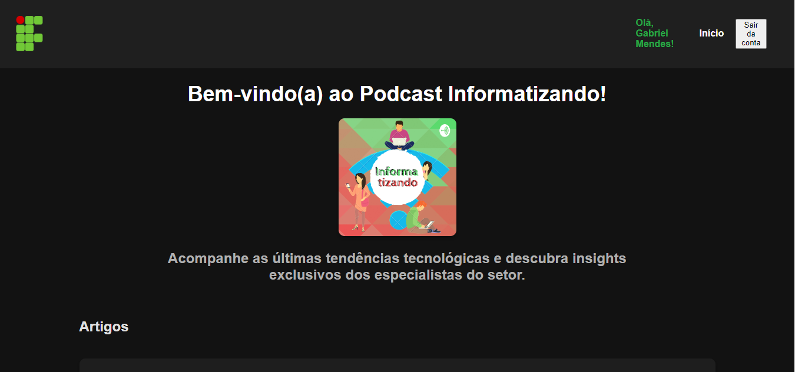
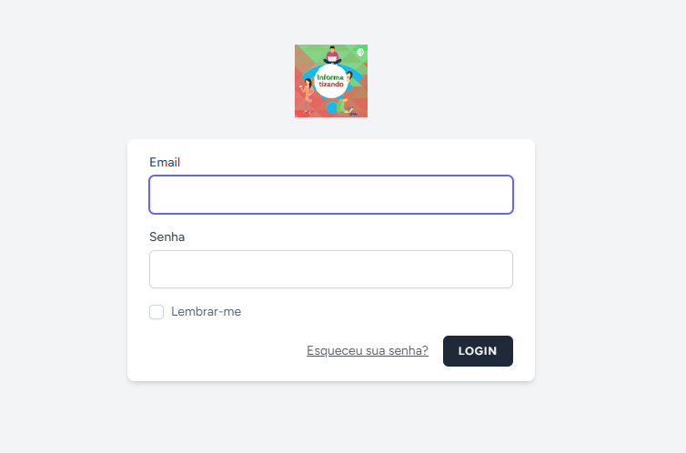
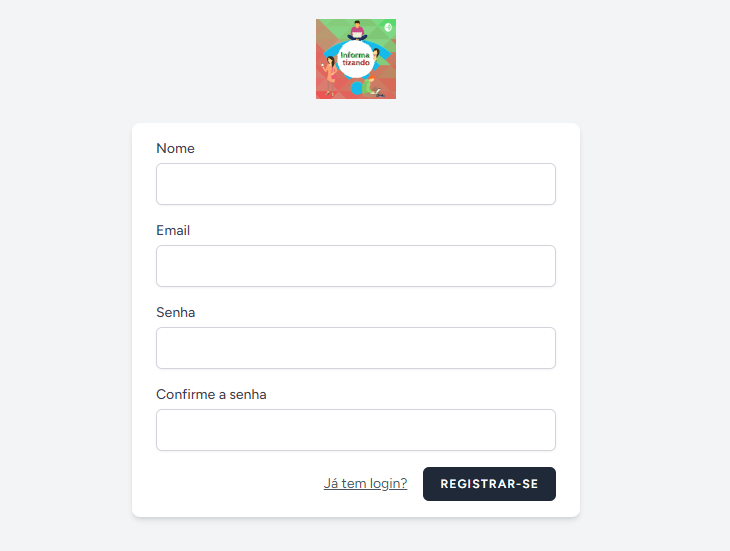

# Projeto "Informatizando"

Este projeto é um site que serve como extensão do podcast "Informatizando". No site, você pode acessar links para os episódios, fornecer feedback e curtir feedbacks de outros usuários. Além disso, o site oferece conteúdos relacionados à tecnologia, como artigos e notícias, além dos próprios episódios.

## Imagens

- Página Principal


- Tela de Login


- Tela de Cadastro


- Página de Feedbacks (Comentários dos usuários e quantidade de curtidas)

## Tecnologias Utilizadas

- Laravel
- HTML
- CSS
- JavaScript
- MySQL
- Livewire
- Jetstream
- Arquitetura MVC

## Pré-requisitos

- Node.js 15 ou superior
- PHP 8.2 ou superior
- MySQL (Você pode baixar o MySQL [aqui](https://dev.mysql.com/downloads/mysql/))

## Configuração e Execução

1. **Clone o Repositório**

    ```bash
    git clone https://github.com/GabrielMendessDev/WebsitePodcastInformatizando.git
    cd WebsitePodcastInformatizando
    ```

2. **Instale as Dependências do Node.js**

    ```bash
    npm install
    ```

3. **Instale as Dependências do Composer**

    ```bash
    composer install
    ```

4. **Instale Livewire e Jetstream**

    ```bash
    composer require livewire/livewire
    composer require laravel/jetstream
    ```

5. **Compile os Arquivos**

    ```bash
    npm run build
    ```

6. **Gere a Chave de Aplicação**

    ```bash
    php artisan key:generate
    ```

7. **Configure o Banco de Dados**

    Crie um arquivo `.env` na raiz do projeto. Você pode obter um arquivo `.env` de exemplo [aqui](https://github.com/laravel/laravel/blob/master/.env.example) e ajustá-lo para o seguinte:

    ```plaintext
    DB_CONNECTION=mysql
    DB_HOST=127.0.0.1
    DB_PORT=3306
    DB_DATABASE=podcast
    DB_USERNAME=root
    DB_PASSWORD=
    ```

8. **Execute as Migrations**

    ```bash
    php artisan migrate
    ```

9. **Inicie o Servidor**

    ```bash
    php artisan serve
    ```

10. **Acesse o Site**

    Abra o navegador e acesse [http://127.0.0.1:8000](http://127.0.0.1:8000).

## Contribuições

Contribuições são bem-vindas! Sinta-se à vontade para abrir issues e pull requests.

---
